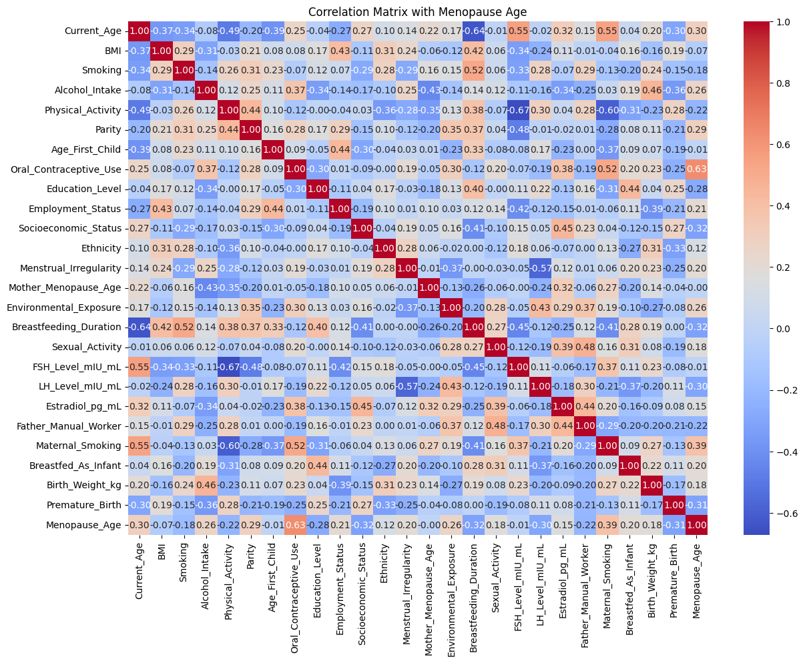

# 🚀 Menopause Age Prediction

Predicting menopause onset age using machine learning and synthetic health data to assist healthcare research and planning personalized interventions.

---

## 📚 Table of Contents
- [About the Project](#about-the-project)
- [Project Architecture](#project-architecture)
- [Tech Stack](#tech-stack)
- [Getting Started](#getting-started)
- [Project Structure](#project-structure)
- [Results](#results)
- [Future Work](#future-work)
- [Acknowledgements](#acknowledgements)
- [Author](#author)

---

## 📖 About the Project

**Goal:**  
- Develop a machine learning model to predict the age of menopause onset based on synthetic health data.
- Address the challenge of early detection for better health outcomes.
- Healthcare providers, researchers, and patients benefit from early insight into menopause timing.

**Key Highlights:**
- 🔹 Used regression-based Machine Learning models.
- 🔹 Integrated healthcare domain knowledge around menopausal health indicators.
- 🔹 Handled data preprocessing challenges including missing values and feature scaling.

---

## 🏛️ Project Architecture

**Workflow:**
- Data Collection: Synthetic health dataset generation.
- Data Preprocessing: Cleaning, handling missing values, feature engineering.
- Model Training: Regression models such as Linear Regression, Random Forest Regressor.
- Model Evaluation: Using metrics like MAE, RMSE.
- Deployment/Export: Trained models saved for later inference.

---

## 🛠️ Tech Stack

| Tool/Framework   | Purpose                        |
|------------------|---------------------------------|
| Python           | Core programming language       |
| Scikit-Learn     | ML model training and evaluation |
| Pandas / NumPy   | Data processing and manipulation |
| Matplotlib / Seaborn | Data visualization           |
| Jupyter Notebook | Interactive development and analysis |

---

## 🎯 Results

### 📊 Model Accuracy Comparison
- **Gradient Boosting** achieved the highest R² score (best accuracy).
- Followed by Decision Tree, Random Forest, and Linear Regression.

### 🧠 Feature Importance (Best Model: Gradient Boosting)
- **Current_Age** is the most important feature.
- Followed by: Mother_Menopause_Age, LH_Level_mIU_mL, BMI, and FSH_Level_mIU_mL.

## 📊 Model Comparison


## 🧠 Feature Importance




## 🚀 Getting Started

### Prerequisites
- Python 3.9+
- pip

### Installation

Clone the repository:
```bash
git clone https://github.com/YOUR_USERNAME/Menopause-Age-Prediction.git
cd Menopause-Age-Prediction


## 👩‍💻 Author

- **Narges**  
  [GitHub Profile](https://github.com/nargesghv)

